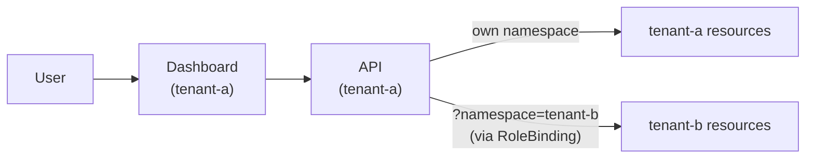

# Tenant and Namespace Management

Ark uses Kubernetes namespaces as tenants. Each namespace is an isolated environment with its own agents, models, tools, and queries. Isolation is enforced at the Kubernetes level via RBAC.

## Setting Up a Tenant

Set your kubectl context to the target namespace and use the Ark CLI to install:

```bash
kubectl create namespace tenant-a
kubectl config set-context --current --namespace=tenant-a
ark install ark-tenant
ark install ark-api
ark install ark-dashboard
```

This installs the tenant chart (service account, roles, builtin tools), the API layer, and the dashboard. You can then open the dashboard with:

```bash
ark dashboard
```

> The Ark CLI uses your current kubectl context namespace. You can also install the charts directly with Helm — see the [Deploying Ark](./deploying-ark) guide.

## Cross-Tenant Access

By default, tenants are fully isolated. A user accessing Tenant A's dashboard cannot see resources in Tenant B. A cluster administrator can grant cross-tenant access using standard Kubernetes RBAC.

### Example: Two Tenants with Cross-Access

Install two full tenants:

```bash
kubectl create namespace tenant-a
kubectl config set-context --current --namespace=tenant-a
ark install ark-tenant
ark install ark-api
ark install ark-dashboard

kubectl create namespace tenant-b
kubectl config set-context --current --namespace=tenant-b
ark install ark-tenant
ark install ark-api
ark install ark-dashboard
```

At this point both tenants are fully isolated. To grant Tenant A access to Tenant B's resources, apply a RoleBinding:

```yaml
apiVersion: rbac.authorization.k8s.io/v1
kind: RoleBinding
metadata:
  name: tenant-a-access
  namespace: tenant-b
subjects:
  - kind: ServiceAccount
    name: ark-api-sa
    namespace: tenant-a
roleRef:
  kind: Role
  name: ark-tenant-role
  apiGroup: rbac.authorization.k8s.io
```

A user on Tenant A's dashboard can now view and manage Tenant B's resources by adding `?namespace=tenant-b` to the URL.



Without the RoleBinding, the API returns a 403 error when attempting to access another tenant's resources.

## Developing with Tenants

During development, use devspace to deploy into a tenant namespace:

```bash
devspace dev -n tenant-a
```

Or set your kubectl context and use the CLI:

```bash
kubectl config set-context --current --namespace=tenant-a
ark dashboard
```

Add `?namespace=tenant-b` to the URL to view another tenant's resources.
